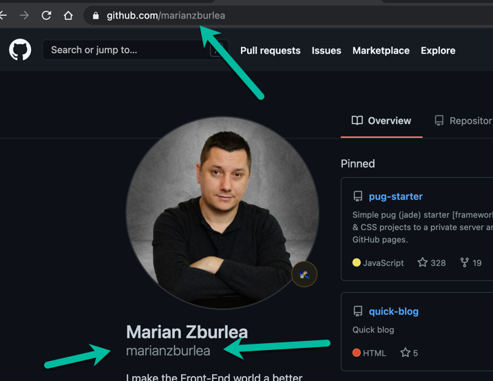

# My CV v3 Starter

Welcome to version three (3) of the project **My CV**. This is the starter version and it's aimed for people that are starting their first (1st) website or are at the very beginning of their career as a web developer.

## Table of contents

1. [What do you get out of it?](#what-do-you-get-out-of-it)
1. [Requirement](#requirement)
1. [How to start?](#how-to-start)
1. [Goo luck](#good-luck)

## What do you get out of it

This is your first PROfessional website where you'll master how to:
1. use Visual Studio Code as your editor
1. use simple icons by creating custom fonts
1. read a design and create pixel perfect interface
1. read instructions, understand and follow requirements
1. create a SPA (single page application)
1. build multiple sections like: about me, let's connect and skills
1. implement a responsive layout
1. meet the user with a light or dark theme
1. create lists, buttons, containers and more

[Back to **Table of contents**](#table-of-contents)

## Requirement

While building this website you want to use only HTML and CSS. No other libraries are required or suggested.

* **STEP 1** - cread a folder (directory) inside the `web` folder, with the name of your github id, all in lowercase (NO CAPITAL LETTERS!)

[Back to **Table of contents**](#table-of-contents)

## How to start

### Create a fork and clone

You want to go to the [My CV v3 - starter](https://github.com/codetapacademy/my-cv-v3-starter) project on GitHub and click the big **Fork** button to create a copy of it on your profile. 

The **Fork** button can be found at the top right corner of the page. Once the _fork_ process has created a copy of the project to your profile, use the big **Clone** green button to make a copy to your computer and proceed just like with any other project clone from GitHub.

## Design

Check out the designs created with Figma: https://www.figma.com/file/BKG4eO58SPw5aq61DXulK3/CV

## Good luck !!

I hope you'll enjoy this project and have fun while you're at it. Stay tuned for more projects to come and the tutorial for this one by following https://codetap.academy and consider subscribing as well. The next projects from this series will be:

* `My CV v3 - Junior` where we'll have fun using `pug-starter`
* `My CV v3 - Mid` where we'll have fun using `React`
* `My CV v3 - Senior` where we'll have fun using `React` and `NodeJS`

[Back to **Table of contents**](#table-of-contents)

Note: Any suggestions so far? If yes, let us know on https://codetap.academy by joining the chat. :) :)
